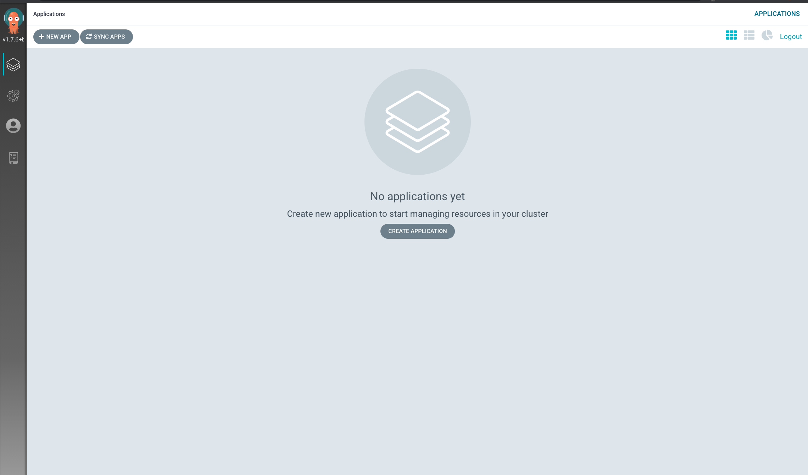
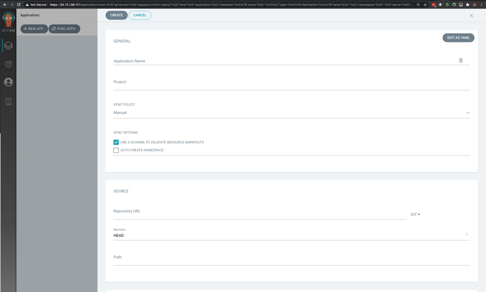
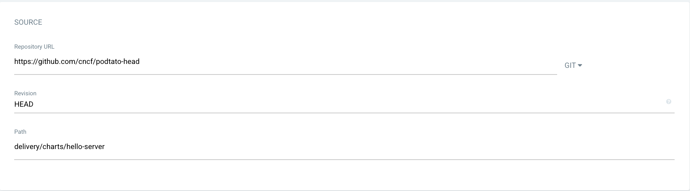
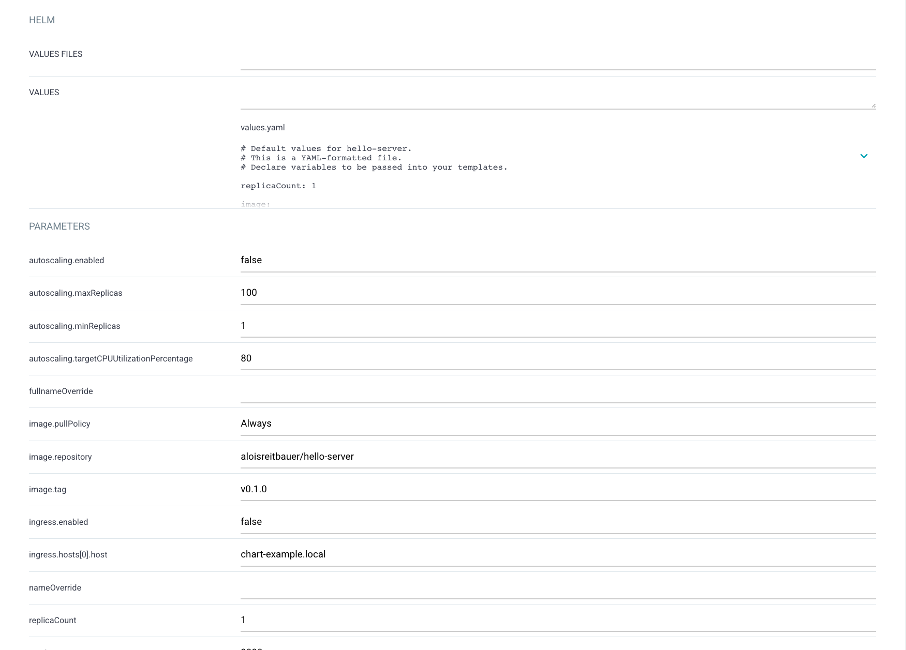
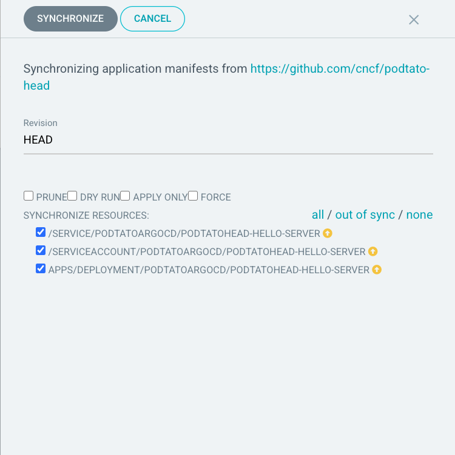
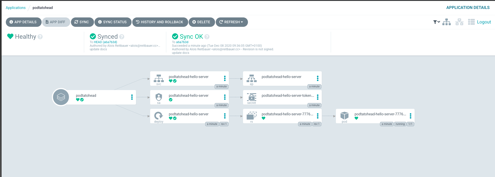
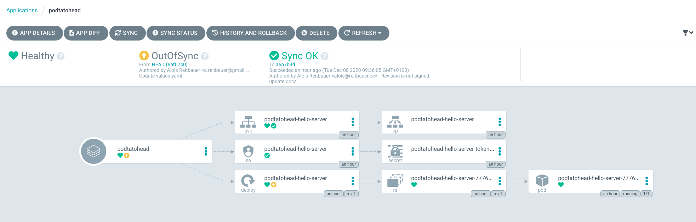
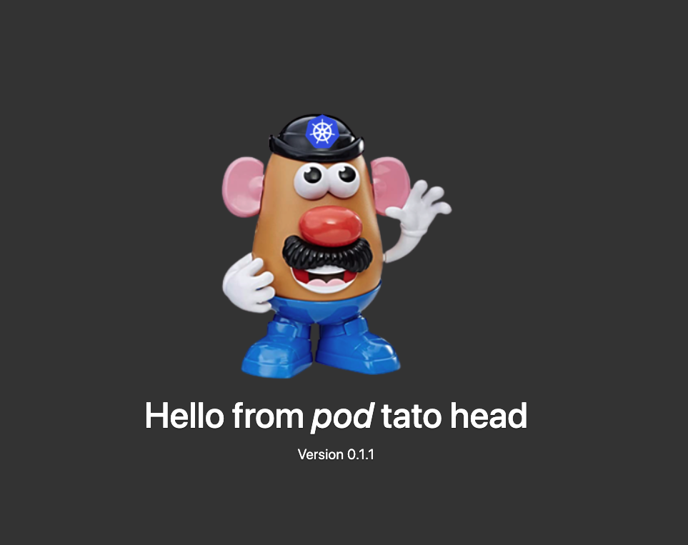

# Delivering the example using GitOps and ArgoCD

## Prerequisites

### Install ArgoCD

You can find detailed instructions on how to install ArgoCD [here](https://argoproj.github.io/argo-cd/getting_started/)

For your convenience, you can find commmands to install Argo below :

- [Install ArgoCD CLI](https://argoproj.github.io/argo-cd/cli_installation/) :

```
VERSION=$(curl --silent "https://api.github.com/repos/argoproj/argo-cd/releases/latest" | grep '"tag_name"' | sed -E 's/.*"([^"]+)".*/\1/')
sudo curl -sSL -o /usr/local/bin/argocd https://github.com/argoproj/argo-cd/releases/download/$VERSION/argocd-linux-amd64
sudo chmod +x /usr/local/bin/argocd
```

- [Install ArgoCD on your cluster](https://argoproj.github.io/argo-cd/getting_started/#1-install-argo-cd) :

```
kubectl create namespace argocd
kubectl apply -n argocd -f https://raw.githubusercontent.com/argoproj/argo-cd/stable/manifests/install.yaml
```

Please follow the rest of the documentation to

- [expose your the ArgoCD UI](https://argoproj.github.io/argo-cd/getting_started/#3-access-the-argo-cd-api-server)
- [get access](https://argoproj.github.io/argo-cd/getting_started/#4-login-using-the-cli) by retrieving the password

### Fork the podtato-head project

This example modifies files within the repository, so you will need your own
fork. The original podtato head repository can be found
[here](https://github.com/cncf/podtato-head)

## Setting up the application in ArgoCD

### Access the ArgoCD UI

If everything went fine so far you should now see the ArgoCD UI.



Now either click on ```New App``` at the top or ```Create Application``` in the
middle of the screen. This will open a screen like this. We will walk through
the configuration in the next part.



### Creating a new application

Now we have to define the proper parameters for your application.

#### Define application data

For the application we define ```podtatohead``` as the application name and leave
the project to ```default```.  We also check ```autogenerate namespace``` to
have ArgoCD take care of namespace management.


#### Setting the Github repo

Use the Github repo you forked before and ensure you set the path to ```
delivery/chart```. This will use the Helm of the tutorial



#### Define destination cluster

In the example we use the local cluster as our destination and
```podtato-argocd``` as the namespace to deploy to. As we checked ```autocreate
namespace``` above ArgoCD will create the namespace for us.


#### Helm Values file

ArgoCD will automatically detect the Helm values files. We do not need to change
anything here and just can leave it as it.



#### Create application

Now hit create application and it should be visible in the project overview.

If you cannot see the application ensure that the filters are set properly.

The application will show up yellow as it has not been synced yet.


## Deploying application versions

### Syncing the project

In order to sync and deploy the application, click ```sync``` at the bottom of the application square.

A new panel appears to show every resource that will be synchronized : click ```synchronize``` to validate.



This will now
create all application ressources in the cluster. Once syncing is finished you
will see all application components as healthy.



And if you go back the the Applications view, your application is now synched and healthy


### Updating the project to a new version

Updating the project required to update the ```values``` file in the
```/delivery/chart``` folder fo your Git
repository. Change some ```tag``` values to another version (```v2-latest-dev```,```v3-latest-dev```,```v4-latest-dev```).

The application will now show up as ```out of sync```. Simply hit ```sync``` and
the application should update



#### Validate update

Access the podtato demo application again and you should see the new version.


