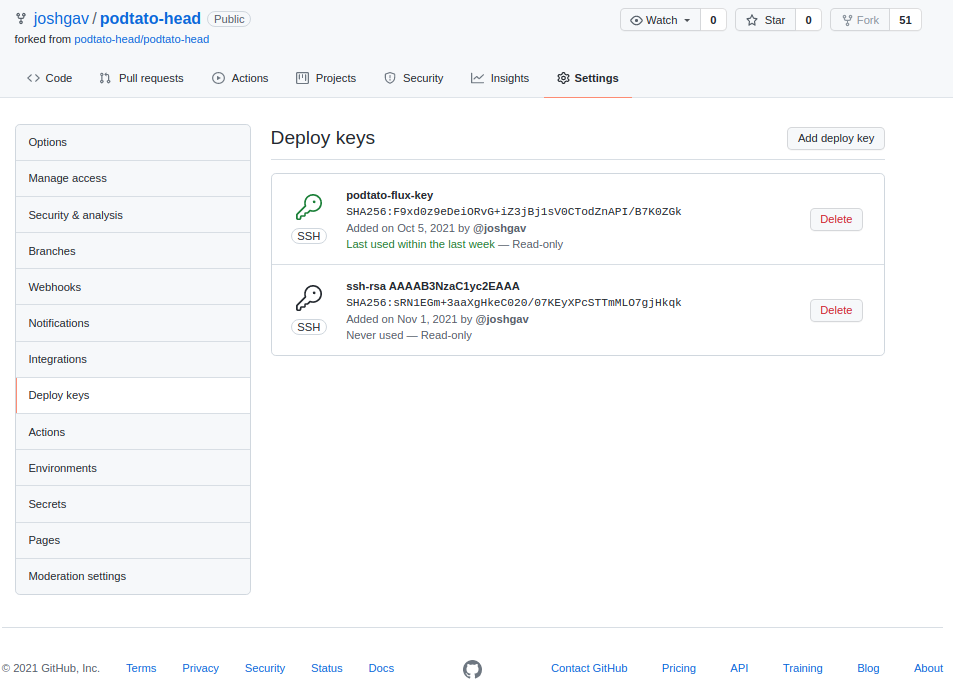

# Deliver with Flux

Here's how to deliver podtato-head using [flux](https://fluxcd.io). Flux deploys
workloads as Helm releases or kustomize renderings.

## Prerequisites

1. Install `flux` CLI ([official
   instructions](https://toolkit.fluxcd.io/guides/installation/))
1. [Get a GitHub personal access token](https://github.com/settings/tokens) with
   _all_ `repo` permissions and set it as the value of environment variable
   `GITHUB_TOKEN`.
1. Install Flux components and commit their configuration to a git repo with the
   `flux bootstrap ...` command.
   
An example follows:

```bash
export GITHUB_TOKEN=<personal_access_token>
export GITHUB_USER=<github_username>
export GITHUB_REPO=flux-tests

flux bootstrap github \
    --owner="${GITHUB_USER}" \
    --repository="${GITHUB_REPO}" \
    --private=false \
    --personal \
    --token-auth

## verify
flux get all
```

> Alternatively, you may use the `flux install` command to install Flux
  controllers without committing their configuration to a git repo. To update the
  Flux control plane later run `flux install` again.

## Deliver

You will fork the podtato-head repo and deliver the podtato-head services to your cluster.

### Connect to git repo

First, [fork the podtato-head repo](https://github.com/podtato-head/podtato-head/fork)
so that you can add an SSH key to it.

Next, connect this forked repo to Flux in your cluster by adding an SSH key pair
and a "source" resource as follows.

#### Create a secret

The `flux create secret git` command creates an SSH key pair for the specified
host and puts it into a named Kubernetes secret in Flux's management namespace
(by default `flux-system`). The command also outputs the public key, which
should be added to the forked repo's "Deploy keys" in GitHub.

```bash
GITHUB_USER=<your_github_username>
flux create secret git podtato-flux-secret \
    --url=ssh://git@github.com/${GITHUB_USER}/podtato-head
```

If you need to retrieve the public key later you can extract it from the secret
as follows:

```bash
kubectl get secret podtato-flux-secret -n flux-system -ojson \
    | jq -r '.data."identity.pub"' | base64 -d
```

Use the public key as a Deploy key in your fork of the podtato-head repo. Browse
to the following URL, replacing `<your_github_username>` with your GitHub
username:
`https://github.com/<your_github_username>/podtato-head/settings/keys`. The page
will appear as follows. Click "Add deploy key" and paste the key data (starts
with `ssh-<alg> ...` ) into the contents. The name is arbitrary, we use
podtato-flux-secret here.



Alternatively, install the [GitHub CLI](https://cli.github.com/) and run the
following commands:

```bash
ssh_public_key=$(kubectl get secret podtato-flux-secret -n flux-system -ojson | jq -r '.data."identity.pub" | @base64d')
gh api repos/${GITHUB_USER}/podtato-head/keys \
    -F title=podtato-flux-secret \
    -F "key=${ssh_public_key}"
```

#### Create a source

Finally, create a git source that uses this secret. The following command
demonstrates how to create a git source imperatively:

```bash
GITHUB_USER=<your_github_username>
flux create source git podtato-flux-repo \
    --url=ssh://git@github.com/${GITHUB_USER}/podtato-head \
    --secret-ref podtato-flux-secret \
    --branch=main

# verify
flux get source git
```

You may prefer to check in a declaration of the git source instead, GitOps
style. To do that, use the Flux CLI to generate a manifest and then check that
into your flux-tests infrastructure repo, as follows. This requires that you
used the `flux bootstrap` installation method described above; execute commands
in the context of that repo. 

First, create a YAML manifest describing the source resource:

```bash
# execute in context of flux-tests repo
GITHUB_USER=<your_github_username>

flux create source git podtato-flux-repo \
    --url=ssh://git@github.com/${GITHUB_USER}/podtato-head \
    --secret-ref podtato-flux-secret \
    --branch=main \
    --export > ./flux-system/podtato-flux-repo.yaml

# verify
cat ./flux-system/podtato-flux-repo.yaml
```

Next, add the new resource to the flux-system kustomization and check in both
the new resource and the modified kustomization:

```bash
echo "- podtato-flux-repo.yaml" >> ./flux-system/kustomization.yaml

git add ./flux-system/podtato-flux-repo.yaml ./flux-system/kustomization.yaml
git commit -m "add podtato-head repo"
git push origin main
```

Finally, watch the cluster get syncronized:

```bash
watch kubectl get -n flux-system gitrepositories
```

### Render and apply

Now that a git source is available you will instruct Flux how to render and
apply it. Flux provides two rendering strategies - kustomizations and
HelmReleases.  Both build on the git repo source created above.

#### HelmRelease

A HelmRelease composes a chart from a git or helm repository with values stored
in the resource and applies it to the cluster.

To create a HelmRelease imperatively:

```bash
# the command only reads values from files so write an override to one first
tmp_values_file=$(mktemp)
echo -e "entry:\n  serviceType: NodePort" > ${tmp_values_file}

flux create helmrelease podtato-flux-release \
    --target-namespace=podtato-flux \
    --create-target-namespace \
    --source=GitRepository/podtato-flux-repo.flux-system \
    --chart=./delivery/chart \
    --values="${tmp_values_file}"

# verify
flux get helmrelease podtato-flux-release
```

To create and check in a declaration for the resource instead:

```bash
tmp_values_file=$(mktemp)
echo -e "entry:\n  serviceType: NodePort" > ${tmp_values_file}

flux create helmrelease podtato-flux-release \
    --target-namespace=podtato-flux \
    --create-target-namespace \
    --source=GitRepository/podtato-flux-repo.flux-system \
    --chart=./delivery/chart \
    --values="${tmp_values_file}" \
    --export > ./flux-system/podtato-flux-release.yaml

# verify
cat ./flux-system/podtato-flux-release.yaml
```

```bash
echo "- podtato-flux-release.yaml" >> ./flux-system/kustomization.yaml

git add ./flux-system/podtato-flux-release.yaml ./flux-system/kustomization.yaml
git commit -m "add podtato-head helmRelease"
git push origin main
```

Finally, watch the cluster get syncronized:

```bash
watch kubectl get -n flux-system helmreleases
```

#### Kustomization

A Kustomization is a render-and-apply strategy based on kustomize. Instead of a
HelmRelease, you may create a kustomization as follows:

```bash
kubectl create namespace podtato-kflux
flux create kustomization podtato-flux-kustomization \
    --target-namespace podtato-kflux \
    --source=GitRepository/podtato-flux-repo.flux-system \
    --path=./delivery/kustomize/base \
    --prune=true

# verify
flux get kustomization podtato-kflux-kustomization
```

Follow the same process described above for git sources and HelmReleases to
check in configuration for this kustomization.

## Test

### Verify delivery

List all apps, get info or get logs for an app:

```bash
flux get all
flux get helmreleases
flux get kustomizations
flux get sources git
kubectl get pods -n podtato-flux
kubectl get pods -n podtato-kflux
```

### Test the API endpoint

To connect to the API you'll first need to determine the correct address and
port.

If using a LoadBalancer-type service for `entry`, get the IP address of the load
balancer and use port 9000:

```
ADDR=$(kubectl get service podtato-entry -n podtato-flux -o jsonpath='{.status.loadBalancer.ingress[0].ip}')
PORT=9000
```

If using a NodePort-type service, get the address of a node and the service's
NodePort as follows:

```
export NODE_NAME=<any_node_name>
ADDR=$(kubectl get nodes ${NODE_NAME} -o jsonpath={.status.addresses[0].address})
PORT=$(kubectl get services podtato-entry -n podtato-flux -ojsonpath='{.spec.ports[0].nodePort}')
```

If using a ClusterIP-type service, run `kubectl port-forward` in the background
and connect through that:

> NOTE: Find and kill the port-forward process afterwards using `ps` and `kill`.

```
ADDR=127.0.0.1
PORT=9000
kubectl port-forward --address ${ADDR} svc/podtato-entry ${PORT}:9000 &
```

Now test the API itself with curl and/or a browser:

```
curl http://${ADDR}:${PORT}/
xdg-open http://${ADDR}:${PORT}/
```

## Update

Flux monitors the source git repo and redeploys the application when it detects
changes.

To update the Flux control plane, run the `flux bootstrap ...` command again; it
will push a new commit to the repo with the latest component configurations.

To update a HelmRelease managed by Flux, make the desired changes to the chart
and bump the `version` property in Chart.yaml, then commit these changes. For
example, change the `replicas` value to `2` in `./delivery/chart/values.yaml`,
bump the `version` value in `./delivery/chart/Chart.yaml`, commit and push the
changes to the git repo, and watch the effects with `kubectl get -n podtato-flux
pods --watch`.

## Rollback

To roll back a chart version, roll back the changes in the git repo! For
example, to roll back the change in the previous section, run `git revert HEAD`
and `git push`, then watch the extra pods get deleted.

## Purge

If resources were created imperatively they may also be destroyed imperatively:

```bash
flux delete --silent helmrelease podtato-flux-release
flux delete --silent kustomization podtato-flux-kustomization
flux delete --silent source git podtato-flux-repo
kubectl delete -n flux-system secret podtato-flux-secret
```

If they were created by checking in declarations they can be reverted by
deleting those declarations and pushing a new git commit.

To remove the Flux control plan, run `flux uninstall`.